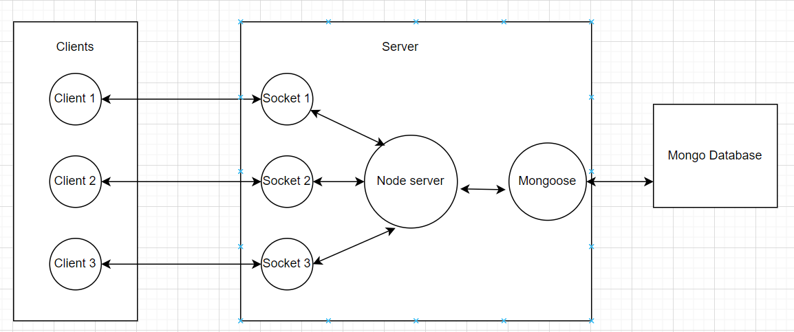

# QA-Clone-Server

A QA session board used at Live sessions where users write down their questions. Any user can ask any number of questions and like any number of question. 

Users can create their own live sessions by creating a board where people ask questions. The questions are displayed in the decreasing order of the number likes it has.

## How to Run

1) npm i
2) create a .env file and write PORT=3000 to specify the port number
3) npx nodemon index.js
4) Clone Frontend Repo: https://github.com/maitra100/QA-Clone-Client
Run the frontend repo at 3001.

## Architecture

## Caution
Don't reload the page once connected else the socket id for a connection for a user changes and then authorization stuff would break (used socket id for authorization instead of name to maintain full anonymity).